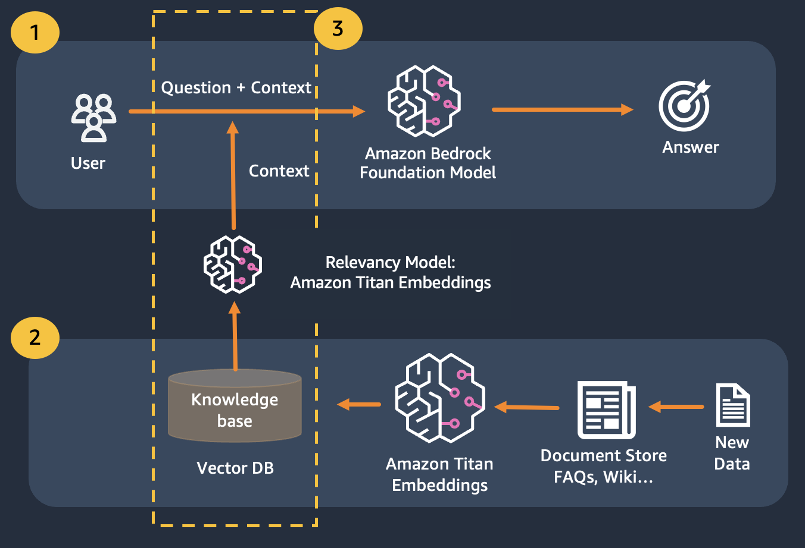

## RAG Pattern

While zero-shot is a nice and give you a good head start, the biggest benefit of using Jarvis on top of Bedrock is
Jarvis ability to use embeddings and the RAG pattern.

So far what we went on the zero shot part is asking a question, while you can also provide some document text in the prompt.

As you can see this is very limited functionality because you will have to find the relevant document
by your self and the document size is also limited to the max tokens the FM supports.

### RAG for the resource

RAG -  Retrieval Augmented Generation  
RAG improves upon the first where we concatenate our questions with as much relevant context as possible,
which is likely to contain the answers or information we are looking for.
The challenge here, There is a limit on how much contextual information can be used is determined by the token limit of the model.
This can be overcome by using Retrieval Augmented Generation (RAG)

Let's go over what we see here and start with phase 2

### Uploading files (2)
Jarvis supports uploading files and taking care of everything that happens.
Jarvis provides the abilities to upload files from SFTP, confluence and webpages.
When you upload files through Jarvis API, Jarvis will do the following:  
1. Get the file (SFTP/Confluence/Webpages)  
2. Split the docs into chunks  
3. Invoke Amazon titan embeddings model to create a vector from the doc chunk  
4. Store the vector created by the Amazon titan embeddings model inside Postgres with pgvector support

> **_SPANISH SUPPORTED:_** Amazon titan embeddings model support working on the spanish language as well, which means
> you can upload docs in spanish and ask question about them in spanish

### Prompt with RAG (1+3)
When jarvis is being asked a question using the prompt API, Jarvis will create a vector from the question 
and will find for us the most similar vectors in the Postgres DB. only then Jarvis will invoke bedrock model together
with the docs it found as the context.

